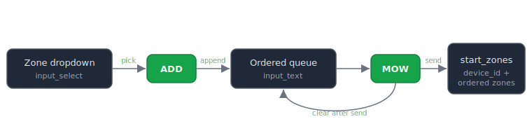

# Lymow Go Mow

A small set of Home Assistant building blocks that add a **"pick zones and mow them in the order you choose"** control for the [Lymow One](https://github.com/Mortimer452/Lymow-One-MQTT) robotic mower.

It sits on top of the [`Lymow-One-MQTT`](https://github.com/Mortimer452/Lymow-One-MQTT) custom integration by [@Mortimer452](https://github.com/Mortimer452), which exposes the `lymow_mqtt.start_zones` action. That action is powerful but it's an *action*, not an entity — so it never shows up as a dashboard control on its own. This repo turns it into a usable UI: a dropdown to pick a zone, an **Add** button to build an ordered queue, and a **Mow** button to send the whole queue to the mower in order.

> **Status:** working against `Lymow-One-MQTT` v0.4.0. Tested on a Lymow One.

---

## What you get

- A **zone picker** (dropdown) populated with your mower's zones.
- An **ordered queue** — add zones one at a time; the mower mows them in that exact order.
- **Mow** / **Clear** buttons.
- An **optional automation** that keeps the dropdown in sync with the mower's zones automatically, so you never hand-edit the list.



---

## Requirements

- Home Assistant (any reasonably current version; uses `perform-action` tap actions).
- The [`Lymow-One-MQTT`](https://github.com/Mortimer452/Lymow-One-MQTT) integration installed and working, with at least one mower set up and its zones already configured in the Lymow app.

---

## Quick start

There are four pieces. Two are **helpers**, one is a set of **scripts**, one is a **dashboard card**.

### 1. Create the two helpers

Either add the blocks from [`config/helpers.yaml`](config/helpers.yaml) to your `configuration.yaml`, **or** create them in the UI
(*Settings → Devices & services → Helpers → + Create Helper*):

| Helper | Type | Name | Resulting entity ID |
|--------|------|------|---------------------|
| Zone picker | **Dropdown** | `Lymow zone` | `input_select.lymow_zone` |
| Queue store | **Text** | `Lymow queue` | `input_text.lymow_queue` |

> ⚠ The entity ID is derived from the name **at creation time** and does *not* change if you rename later. Make sure you end up with exactly `input_select.lymow_zone` and `input_text.lymow_queue`, since the scripts reference those.

Edit the dropdown options to match **your** zone names exactly as they appear in the Lymow app (without the "Zone " prefix Home Assistant shows in the entity list — use `Apple Tree`, not `Zone Apple Tree`).

### 2. Find your mower's device ID

The `start_zones` action requires a **device target** — specifically the 32-character hex device ID. It does **not** accept an `entity_id`.

Get the hex string from either place:

- *Settings → Devices & services → Devices → (your mower)* — the browser URL ends in `/config/devices/device/<THIS_HEX>`.
- *Developer Tools → Actions →* search `Lymow: Start zones` → **UI mode** → pick the mower in Targets → **YAML mode** → copy the `device_id:` value.

### 3. Add the scripts

Copy the three scripts from [`config/scripts.yaml`](config/scripts.yaml) into your scripts file, and set your device ID in the one marked line of `lymow_queue_mow`:

```yaml
    - action: lymow_mqtt.start_zones
      target:
        device_id: <YOUR_MOWER_DEVICE_ID>   # <-- paste your hex string here
```

- If your `configuration.yaml` uses `script: !include scripts.yaml`, paste the three blocks **without** any top-level `script:` key (the file in `config/` is already in this form).
- If you define scripts inline in `configuration.yaml`, nest them under a `script:` key.

Then reload: *Developer Tools → YAML → Check Configuration*, then **Reload Scripts** (no restart needed).

### 4. Add the dashboard card

Edit a dashboard → **+ Add Card → Manual**, and paste the contents of [`dashboard/zone_queue_card.yaml`](dashboard/zone_queue_card.yaml).

That's it — pick a zone, **Add**, repeat, then **Mow**.

---

## Optional: auto-sync the dropdown

If you don't want to hand-maintain the dropdown options, add the automation in [`config/auto_populate.yaml`](config/auto_populate.yaml). It reads the mower's per-zone sensors and rewrites the dropdown options at startup and whenever a zone changes. Verify the friendly-name prefix it strips matches your entities before relying on it.

---

## How it works

```
input_select.lymow_zone  ──pick──►  [ ADD ]  ──appends──►  input_text.lymow_queue
                                                                   │
                                                              [ MOW ] ──► lymow_mqtt.start_zones (device_id, ordered zones)
                                                                   │
                                                              [ CLEAR ] ──► empties the queue
```

The queue is just a comma-separated string in a text helper. **Mow** splits it, trims blanks, and passes the ordered list to `start_zones`, then clears it.

See [docs/USAGE.md](docs/USAGE.md) for the step-by-step flow and [docs/TROUBLESHOOTING.md](docs/TROUBLESHOOTING.md) for the gotchas (most of which we hit while building this).

---

## Tools

[`tools/lymow_raw_tap.py`](tools/lymow_raw_tap.py) is an optional standalone script that taps the same AWS IoT MQTT channel the integration uses and dumps the raw, fully-decoded protobuf stream — handy for discovering zone hashIds or debugging. It reuses the integration's own modules. See the header comment for setup.

---

## Credits & disclaimer

- Built on top of [`Mortimer452/Lymow-One-MQTT`](https://github.com/Mortimer452/Lymow-One-MQTT) — all the hard protocol work lives there.
- File organisation, YAML scaffolding, docs, and debug tooling assisted by [Claude](https://claude.ai) (Anthropic).
- This repo only contains Home Assistant YAML/automation glue and a debug helper. It is not affiliated with or endorsed by Lymow.
- Sending mow commands moves a real machine with spinning blades. Use sensible safety practices and don't rely on fire-and-forget commands for anything safety-critical.

## License

MIT — see [LICENSE](LICENSE).
